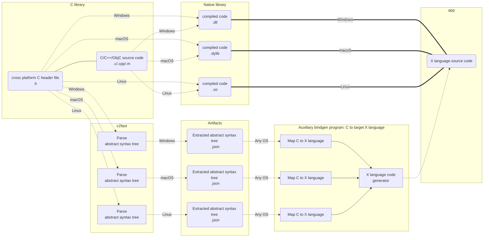

# CAstFfi

Convert a cross-platform C header `.h` to to a FFI (foreign function interface) abstract syntax tree (AST) `.json` for the purposes of generating bindings to other languages.

## Background: Why?

### Problem

When creating applications (especially games) with higher level languages (such as C#, Java, Python), it's sometimes necessary to dip down into C for access to a native library with better raw performance and overall better portability of different low-level APIs accross various platforms. However, the problem is that maintaining the higher level language bindings by hand becomes time consuming, error-prone, and in some cases quite tricky.

Note that C++, ObjectiveC, or other low-level languages are not considered as part of the problem scope because they do not align to specific goals. Though, perhaps [Zig](https://ziglang.org) or some other language may emerge in the future as superior to C for such goals. The goals are the following:

- Portability. For better or worse, C *can be used* as the industry's standard portable assembler even if technically speaking it is not. Writing a native library in the C language (with some constraints) and building it for multiple targets such as Windows, macOS, Linux, iOS, Android, etc, is the path of least resistance. This is especially true for more non-traditional targets such as RaspberryPi, WebAssembly or consoles.

- Interopability. The C language, specfically the usage of data structures and functions in limited scope, is a common demonitor between C and higher level languages. This makes interaction between C and and other languages not only correct but as fast and efficient as possible.

- Maintainability. Writing and maintaining a C code project is arguably simpler due to C being a relatively small language in comparison to C++/ObjectiveC. This makes the C language arguably easier to learn and work with, especially if limited in scope such as avoiding the use of function-like macros. This is important for open-source projects (in contrast to proprietary-enterprise-like projects) where one of the barriers to development is knowledge sharing at scale in a decentralized fashion.

### Solution

Automate the first step of generating bindings for a higher level language by parsing a C `.h` file using[libclang](https://clang.llvm.org/docs/Tooling.html) and extracting out the minimal abstract syntax tree `.json` required for a FFI (foreign function interface) with other languages. This process happens once for each Clang target triple `arch-vendor-os-environment`).

Refer to the following graph as an example for a FFI between C and target language `X`.

