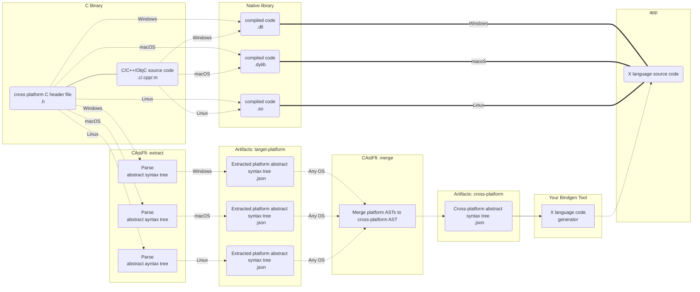

# CAstFfi

Archived - Please see https://github.com/bottlenoselabs/c2ffi/ instead.

Convert a cross-platform C header `.h` to a FFI (foreign function interface) abstract syntax tree (AST) `.json` for the purposes of generating bindings to other languages.

## Background: Why?

### Problem

When creating applications (especially games) with higher level languages (such as C#, Java, Python), it's sometimes necessary to dip down into C for access to a native library with better raw performance and overall better portability of different low-level APIs accross various platforms. This works great, however, the problem is that maintaining the higher level language bindings by hand becomes time consuming, error-prone, and in some cases quite tricky, especially when the C library changes frequently.

Note that C++ or other low-level languages are not considered as part of the problem scope because they do not align to specific goals. Though, perhaps [Zig](https://ziglang.org) or some other language may emerge in the future as superior to C for such goals. The goals are the following:

- Portability. For better or worse, C *can be used* as the industry's standard portable assembler even if technically speaking it is not. Writing a native library in the C language (with some constraints) and building it for multiple targets such as Windows, macOS, Linux, iOS, Android, etc, is the path of least resistance. This is especially true for more non-traditional targets such as RaspberryPi, WebAssembly or consoles.

- Interopability. The C language, specfically the usage of data structures and functions in limited scope, is a common demonitor between C and higher level languages. This makes interaction between C and and other languages not only correct but as fast and efficient as possible.

- Maintainability. Writing and maintaining a C code project is arguably simpler due to C being a relatively small language in comparison to C++/ObjectiveC. This makes the C language arguably easier to learn and work with, especially if limited in scope such as avoiding the use of function-like macros. This is important for open-source projects (in contrast to proprietary-enterprise-like projects) where one of the barriers to development is knowledge sharing at scale in a decentralized fashion.

### Solution

Automate the first step of generating bindings for a higher level language by parsing a cross-platform C `.h` file using [libclang](https://clang.llvm.org/docs/Tooling.html) and extracting out the minimal abstract syntax tree `.json` required for a FFI (foreign function interface) with other languages.

Refer to the following graph as an example for a FFI between C and target language `X`.



### Limitations: Is the C library FFI ready?

`CAstFfi` does not work for every C library. This is due to some technical limitations where some usages of C for cross-platform foreign function interface (FFI) are not appropriate. Everything in the [**external linkage**](https://stackoverflow.com/questions/1358400/what-is-external-linkage-and-internal-linkage) of the C API is subject to the following list for being "FFI Ready". Think of it as the check list to creating a cross-platform C library for usage by other languages.

Note that the internals of the C library is irrelevant and to which this list does not apply. It is then possible to use C++/ObjectiveC behind a implementation file (`.cpp` or `.m` respectively) or reference C++/ObjectiveC from a C implementation file (`.c`); all that `CAstFfi` needs is the C header file (`.h`).

|Supported|Description|
|:-:|-|
|✅|Variable externs <sup>3, 7</sup>|
|✅|Function externs <sup>3, 7</sup>|
|✅|Function prototypes (a.k.a., function pointers.) <sup>3, 7</sup>|
|✅|Enums <sup>2</sup>|
|✅|Structs <sup>3, 4, 7</sup>|
|✅|Unions <sup>3, 4, 7</sup>|
|✅|Opaque types. <sup>3, 7</sup>|
|✅|Typedefs (a.k.a, type aliases) <sup>3, 7</sup>|
|❌|Function-like macros <sup>5</sup>|
|✅|Object-like macros <sup>3, 6, 7</sup>|

<sup>1</sup>: **Not yet implemented**.

<sup>2</sup>: Do not use 64-bit enums due to compiler determinism in C. Enums must be 32-bit in size or less in C. Do not assume the value of an enum is always an unsigned or signed integer in C. However for the purposes of the FFI, enums are forced to be signed type.

<sup>3</sup>: Do use standard integer types from `stdint.h` such as `int32_t`, `uint64_t`, etc which are portable. Do not use C's primitive integer types directly such as `unsigned long` as they are not garanteed to portable due to possibly having different bitwidths for different compilers or platforms.

<sup>4</sup>: Do not use bitfields. This is because bitfields may have different bit layouts across different
compilers (e.g. GCC vs MSCV) which may break portability.

<sup>5</sup>: Function-like macros are only possible if the parameters' types can be inferred 100% of the time during preprocessor; otherwise, not possible. **Not yet implemented**.

<sup>6</sup>: Object-like macros have full support. The value type is determined by evaluating the value of the macro as an C expression using `auto` in C++ to determine the type.

<sup>7</sup>: Types must be explicitly transtive to a function extern, variable extern, or macro-object so that they can be included as part of the AST. E.g. a function extern which uses an integer as a parameter but is really expecting an enum that is not a transitive type will cause the "dangling" enum to not be included as part of the AST.

### Platforms

Support for generating the FFI AST of a C library for different target platforms using `CAstFfi` is dependent on two things:

1. A ["Clang target triple"](https://clang.llvm.org/docs/CrossCompilation.html) (a.k.a. "target platform"). Target platforms are identified by a string in a specific format of `arch-vendor-os-environment` and passed to Clang which informs how to read C code.

2. System C header `.h` files of the target platform. The root directory of where the files are located need to be passed to Clang to read C code correctly. The files are often distributed and installed with a software development environment (SDE) or additional downloadable components to the SDE in a form of a software development kit (SDK). By default for Windows, macOS, and Linux, `CAstFfi` will find these system headers automatically by searching for default installed locations.

The following table demonstrates commonly used target platforms.

|Open|OS|Arch|SDE|Clang Target Triple
|:-:|:-:|:-:|:-:|:-:|
|🔓|Windows|`ARM64`|[MinGW](https://en.wikipedia.org/wiki/MinGW)|`aarch64-pc-windows-gnu`
|🔓|Windows|`X64`|[MinGW](https://en.wikipedia.org/wiki/MinGW)|`x86_64-pc-windows-gnu`
|🔓|Windows|`X86`|[MinGW](https://en.wikipedia.org/wiki/MinGW)|`i686-pc-windows-gnu`
|🔒<sup>1</sup>|Windows|`ARM64`|[MSVC](https://en.wikipedia.org/wiki/Microsoft_Visual_C%2B%2B)|`aarch64-pc-windows-msvc`
|🔒<sup>1</sup>|Windows|`X64`|[MSVC](https://en.wikipedia.org/wiki/Microsoft_Visual_C%2B%2B)|`x86_64-pc-windows-msvc`
|🔒<sup>1</sup>|Windows|`X86`|[MSVC](https://en.wikipedia.org/wiki/Microsoft_Visual_C%2B%2B)|`i686-pc-windows-msvc`
|🔒<sup>2</sup>|macOS|`ARM64`|[XCode](https://en.wikipedia.org/wiki/Xcode)|`aarch64-apple-darwin`
|🔒<sup>2</sup>|macOS|`X64`|[XCode](https://en.wikipedia.org/wiki/Xcode)|`x86_64-apple-darwin`
|🔒<sup>2</sup>|macOS|`X86`|[XCode](https://en.wikipedia.org/wiki/Xcode)|`i686-apple-darwin`
|🔓|Linux (kernel)|`ARM64`|[CMake](https://en.wikipedia.org/wiki/CMake) recommended|`aarch64-unknown-linux-gnu`
|🔓|Linux (kernel)|`X64`|[CMake](https://en.wikipedia.org/wiki/CMake) recommended|`x86_64-unknown-linux-gnu`
|🔓|Linux (kernel)|`X86`|[CMake](https://en.wikipedia.org/wiki/CMake) recommended|`i686-unknown-linux-gnu`
|🔒<sup>2</sup>|iOS|`ARM64`|[XCode](https://en.wikipedia.org/wiki/Xcode)|`aarch64-apple-ios`
|🔒<sup>2</sup>|iOS|`X64`|[XCode](https://en.wikipedia.org/wiki/Xcode)|`x86_64-apple-ios`
|🔒<sup>2</sup>|tvOS|`ARM64`|[XCode](https://en.wikipedia.org/wiki/Xcode)|`aarch64-apple-tvos`
|🔒<sup>2</sup>|tvOS|`X64`|[XCode](https://en.wikipedia.org/wiki/Xcode)|`x86_64-apple-tvos`
|🔒<sup>3</sup>|Android|`ARM64`|[Android Studio](https://en.wikipedia.org/wiki/Android_Studio)|`aarch64-linux-android`
|🔒<sup>3</sup>|Android|`X64`|[Android Studio](https://en.wikipedia.org/wiki/Android_Studio)|`x86_64-linux-android`

|Column|Notes|
|:-:|-|
|Open|If a target platform has an `🔓` here it means the system headers can be distributed and installed under a free and open-source (FOSS) license. If a target platform has an `🔒` here it means the system header can not be distributed under a (FOSS) license.|
|OS|The operating system of the target platform.|
|Arch|The computer architecture (a.k.a instruction set architecture) of the target platform.|
|SDE|The software development environment (SDE) required to build native libraries for the target platform.|

<sup>1</sup>: Microsoft does not allow open distribution of their software development kits (SDKs) due to their [Microsoft Software License Terms](https://docs.microsoft.com/en-us/legal/windows-sdk/redist). However, you can [download and install the SDKs here for Windows here](https://developer.microsoft.com/en-us/windows/downloads/windows-sdk/). You will find the important directories for the C headers on your machine at `%ProgramFiles(x86)%\Windows Kits\10\Include`. This effectively means that to generate FFI ASTs for target platforms which are Windows, `CAstFfi` must run from Windows with the Windows SDK installed.

<sup>2</sup>: Apple does not allow copy or usage of their software development kits (SDKs) on non-Apple hardware due to their [service level agreement](https://www.apple.com/legal/sla/docs/xcode.pdf). You can download and install XCode through the App Store to gain access to the SDKs for macOS, iOS, tvOS, watchOS, or any other Apple target platform. This effectively means that to generate FFI ASTs for target platforms which are Apple, then `CAstFfi` must run from macOS with XCode installed and additional SDKs for each target platform (e.g. macOS, iOS, tvOS) are also installed through XCode.

<sup>3</sup>: Google does not allow copy or usage of their software development kits (SDKs) due to their [Android Software Development Kit License Agreement](https://developer.android.com/studio/terms). You can download and install Android Studio to gain access to the SDKs for Android. This effectively means that to generate FFI ASTs for target platforms which are Android, then `CAstFfi` must run from Windows, macOS, or Linux with Android Studio installed and additional SDKs for each target platform are also installed through Android Studio or equivalent.

Note that pointers such as `void*` can have different sizes across target computer architectures. E.g., `X86` pointers are 4 bytes and `X64` (aswell as `ARM64`) pointers are 8 bytes. This means that ASTs that `CAstFfi` generates between 32-bit and 64-bit target platforms will have different return type sizes, parameter type sizes, or record sizes when using pointers. That being said, 64-bit word size is pretty ubiquitous on Windows these days, at least for gaming, as you can see from [Steam hardware survey where 64-bit is 99%+](https://store.steampowered.com/hwsurvey/directx/). Additionally, you can see that the ["trend" is that 64-bit is becoming standard over time with 32-bit getting dropped](https://en.wikipedia.org/wiki/64-bit_computing#64-bit_operating_system_timeline). If you are planning on targeting modern machines, I would advise making your life simple and just forgeting about target platforms with 32-bit computer architectures such as `X86` and `ARM32`.

## Getting Started

### Install

```bash
dotnet tool install bottlenoselabs.castffi.tool -g
```

### Usage `extract`

Extract the platform specific abstract syntax tree `.json` files.

`config-extract.json`:
```json
{
  "inputFilePath": "path/to/libary/include/header.h",
  "userIncludeDirectories": [
    "path/to/other_library/include"
    ],
  "targetPlatforms": {
    "windows": {
      "x86_64-pc-windows-msvc": {},
      "aarch64-pc-windows-msvc": {}
    },
    "macos": {
      "aarch64-apple-darwin": {},
      "x86_64-apple-darwin": {},
    },
    "linux": {
      "x86_64-unknown-linux-gnu": {},
      "aarch64-unknown-linux-gnu": {}
    }
  }
}
```

Terminal:
```bash
castffi extract path/to/config-extract.json
```

NOTE: The `targetPlatforms` in the `config.json` is a matrix of operating systems to extract the Clang target triples on. In other words, it will only extract the Clang target triple when on the specific operating systems. For example given the `config.json` above, when the current operating system is `windows`, only the `x86_64-pc-windows-msvc` and `aarch64-pc-windows-msvc` target triples will extracted.

### Usage `merge`

Once one or more platform abstract syntax tree `.json` files have been extracted, merge them together into a cross-platform abstract syntax tree.

Terminal:
```bash
castffi merge --inputDirectoryPath /path/to/platform/ast --outputFilePath /path/to cross-platform-ast.json
```


